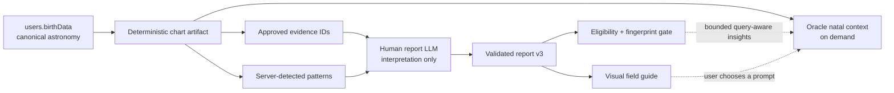

# Birth Chart System: Human Report and Oracle Context

> Implementation reference for contract v3 / pipeline version 7. Updated 2026-07-22.

## Product decision

The system has two artifacts with an explicit authority boundary:

1. **Oracle canonical natal context** is a deterministic, server-built translation of `users.birthData`. It is created on demand only for capabilities that require natal evidence and is the sole authority for chart facts.
2. **The human Birth Chart Report** is a concise, visual, one-time reading artifact. An LLM writes interpretations against server-approved evidence IDs, while chart facts, named patterns, visual identity, and source integrity remain deterministic.

For a birth-chart pipeline, Oracle may also receive a compact, query-aware subset of a completed pipeline-v7 structured report. This is a subordinate interpretation layer for continuity, prioritization, and personalization—not a second source of placements or aspects. Missing, stale, malformed, legacy-semantic, or fingerprint-mismatched reports are silently excluded, so report generation never gates Oracle.



## Canonical source and deterministic artifact

`users.birthData` remains the only source of natal fact. It stores resolved birth time and location plus the calculated whole-sign chart: Ascendant, planets and points, longitudes, houses, retrograde state, dignities, and major aspects.

`src/lib/birth-chart/report-context.ts` converts it into a `BirthChartContextArtifact` with a stable schema version, source fingerprint, exact chart data, traditional chart ruler, dominant element, locally detected patterns, and a closed inventory of stable evidence IDs.

Example evidence IDs:

```text
placement:sun
aspect:moon:trine:jupiter
dignity:moon:domicile
cluster:sign:gemini
cluster:house:11
chart_ruler
nodal_axis
```

`serializeBirthChartForOracle` serializes this artifact directly for Oracle. The block identifies itself as a deterministic translation of `users.birthData` and explicitly disallows invented facts.

## Oracle behavior

`convex/oracle/llm.ts` gathers natal data only when the active pipeline or capability plan requires it. The resulting `PipelineContext.birthData` contains the deterministic chart artifact.

The Oracle path has these guarantees:

- normal Oracle conversations do not require a completed human report;
- report Markdown, visual identity, follow-up prompts, and the full stored JSON are never injected;
- only a bounded subset of a completed pipeline-v7/contract-v3 report with matching top-level and structured source fingerprints is eligible;
- canonical birth data is injected first and always wins any conflict with report prose;
- full-chart requests create a completeness contract for every available canonical entity, including nodes, Chiron, and Part of Fortune;
- natal aspect claims are checked against stored canonical aspects and repaired or rejected when unsupported;
- non-temporal natal answers are buffered until response-contract and output-safety validation pass, so a rejected draft is never published;
- report generation failure cannot block Oracle;
- changing the human report does not change canonical chart context;
- journal context remains independently consent-gated on the server;
- hardcoded Oracle crisis and response-safety rules remain unchanged.

The bounded report block includes identity, relevant validated themes/signature, relevant compass areas, selected toolkit practices, and the two onboarding answers as tone/emphasis only. Broad requests receive the full bounded interpretation set; narrow requests receive only matching evidence-backed sections. Every major answer claim must still cite canonical evidence.

The dedicated report session is the only session that activates report onboarding. This keeps the questionnaire in the familiar Oracle UI without turning it into a global product gate.

The questionnaire is intentionally a two-touch personalization lens, not an intake form. The user may choose one place for the chart to meet them and one preferred voice, or skip both and generate directly from canonical chart data. Names come from the existing profile; the flow does not ask for pronouns, personal disclosures, custom context, or a review step. Legacy profiling fields remain readable for existing records.

When a signed-in user reaches `/oracle/new` with canonical birth data and no report/onboarding record, the client automatically creates or reuses this dedicated session and redirects to its questionnaire. A bare legacy `pending` record also enters this repair path. Once the questionnaire step exists, ordinary `/oracle/new` conversations are no longer redirected.

## Pattern detection

`src/lib/birth-chart/patterns.ts` detects only patterns supported by stored canonical data. It does not use the LLM.

Supported exact or strongly derived patterns include:

- Grand Trine, T-Square, Grand Cross, Mystic Rectangle, Kite, and Minor Grand Trine;
- sign and house stelliums;
- Bundle, Bowl, Locomotive, and Splash chart shapes when geometry passes a conservative threshold;
- element/modality singletons;
- traditional mutual reception;
- unaspected core planets with no stored major aspect.

`Peregrine` remains a dignity concept. It is never inferred from the absence of a stored aspect, and report validation blocks legacy content that conflates the two meanings.

If no named configuration is available, the tightest stored major aspect becomes a clearly labeled personal signature. Patterns that require unavailable minor aspects, such as Yods or Thor's Hammer, are not claimed.

Every detected pattern records its planets, signs, houses, evidence IDs, rarity, and confidence. The human-report LLM may explain a supplied pattern but cannot create or rename one.

## Human report contract v3

`convex/birthChartReport/v3.ts` defines a deliberately smaller artifact:

```text
meta
visualIdentity          server-derived
identity                anchor phrase, one sentence, orientation
chartSignature          one server-detected pattern + useful interpretation
themes                  exactly three memorable themes
compass                 inner world, relationships, vocation, growth
toolkit                 decision, reset, and connection practices
oraclePrompts           exactly four focused follow-ups
```

The report omits the old six long life-area essays, large integration appendix, repeated gifts/growth lists, seven-day plan, and LLM-authored technical appendix. Calculated placements remain available in a deterministic disclosure in the UI.

### Evidence boundary

The LLM returns `evidenceIds`, not free-form evidence objects. During validation the server resolves each ID against the approved inventory and hydrates the stored evidence. Unknown IDs fail validation. This prevents a structurally valid report from persisting invented placements, aspects, houses, dignities, rulers, or nodes.

### Concision and quality boundary

The validator strictly enforces exact section counts and keys, three distinct themes, four focused Oracle prompts, approved evidence IDs, an existing server-detected `patternId`, and valid practice cadence values. Field lengths are editorial copy budgets: concise-but-substantive text is accepted and over-budget text is deterministically trimmed, so a harmless length miss cannot fail an otherwise sound report or trigger a paid repair call.

Structural, chart-integrity, and semantic-integrity validation is blocking in v3. The semantic gate rejects legacy `peregrine:` pattern IDs, dignity/aspect conflation, unsupported “lacks aspect support” wording, and inflated deterministic claims. Editorial checks for generic language, observable-action wording, and total prose budget request one repair pass, but remain advisories afterward because they are heuristic rather than proof of an invalid report. A repaired artifact is saved when it passes the strict schema and chart-evidence boundary; only another blocking failure enters the durable job retry path.

## Generation and persistence

`convex/birthChartReport/generate.ts` uses the central AI Gateway feature `birth_chart_report` in JSON mode with a smaller token budget than the legacy report:

1. Load canonical birth data.
2. Build deterministic context, evidence, patterns, and fingerprint.
3. Send questionnaire answers only as an untrusted emphasis lens.
4. Parse and hydrate contract-v3 JSON.
5. Run blocking structural/chart-integrity checks and advisory editorial checks.
6. Attempt one constrained repair when necessary; do not fail valid structured output on residual editorial heuristics.
7. Render concise Markdown deterministically as an archival fallback.
8. Persist only if the current chart fingerprint still matches the generation source.

Stored `version` is pipeline version `7`; structured `meta.version` is contract version `3`. `sourceChartFingerprint` links the artifact to its canonical input. Version 7 is the minimum Oracle-eligible report version because it includes corrected unaspected semantics and the bounded interpretation contract.

## Visual experience

`BirthChartReportExperience.tsx` renders v3 as a dark observatory field guide instead of a Markdown document. Its signature element is a **pattern seal**: actual planetary longitudes form the wheel, while planets participating in the primary pattern are connected and illustrated with existing planet assets.

The opening headline is the report's chart-specific anchor phrase. The user name appears only as quiet ownership metadata. Model-authored product labels are ignored, and the server deterministically stores `Your Birth Chart` or `<name>’s Birth Chart` as the archival title.

The report also includes a visual Big Three strip, one high-value chart-signature card, three concise evidence-backed theme cards, a four-direction life compass, three practical interventions, four direct Oracle continuations, and a collapsed deterministic placements table. It supports responsive layout, visible keyboard focus, reduced motion, and print.

Contract-v2 reports continue to render with the legacy component. Their page offers an explicit upgrade action that queues v3.

## State and reliability

```text
User: absent -> pending/questionnaire -> pending/queued -> generating -> completed
                                                                  \-> failed -> retry

Job:  queued -> processing -> completed
                           \-> queued (backoff retry)
                           \-> failed (attempts exhausted)
```

Reliability rules:

- selection and claim happen in one Convex mutation;
- report-session creation atomically persists the welcome message and `questionnaire` step;
- the chat self-heals older bare `pending` records after verifying auth, ownership, birth data, and report-session identity;
- job creation rechecks active work inside the mutation;
- nonterminal failures schedule exponential retry;
- the five-minute cron remains a recovery path;
- processing leases older than ten minutes are recovered or terminally failed;
- chat and report pages expose explicit failure/retry UI;
- questionnaire submission is independent from normal Oracle quota;
- save rejects work generated from birth data that changed mid-run;
- any explicit birth-data update invalidates the human report while Oracle immediately uses the new chart.

## Migration and compatibility

- Existing v2 structured reports and Markdown remain readable.
- Existing v2 reports and pre-v7 v3 reports remain readable but are not Oracle-eligible.
- Users can choose **Upgrade visual report** to generate the current pipeline version; queue eligibility compares the stored pipeline version with version 7.
- A completed current-version report cannot be enqueued again through the ordinary action.
- No destructive database migration is required; new fields are optional.

## Key files

| Responsibility | File |
| --- | --- |
| Canonical chart storage | `convex/schema.ts`, `convex/users.ts` |
| Deterministic chart artifact and evidence | `src/lib/birth-chart/report-context.ts` |
| Bounded Oracle report eligibility and selection | `src/lib/birth-chart/oracle-report-context.ts` |
| Shared report pipeline version | `src/lib/birth-chart/report-version.ts` |
| Pattern detection | `src/lib/birth-chart/patterns.ts` |
| Human report contract and Markdown fallback | `convex/birthChartReport/v3.ts` |
| Human report prompts | `convex/birthChartReport/prompts.ts` |
| Generation and blocking validation | `convex/birthChartReport/generate.ts` |
| Durable queue and retries | `convex/birthChartReport/queue.ts`, `worker.ts` |
| Oracle natal-context integration | `convex/oracle/llm.ts`, `src/lib/oracle/pipelines/birthChart.ts` |
| V3 visual report | `src/components/oracle/BirthChartReportExperience.tsx` |
| Report route and migration UI | `src/app/(app)/oracle/birth-chart-report/page.tsx` |
| Focused contract tests | `src/lib/birth-chart/report-context.test.ts` |
