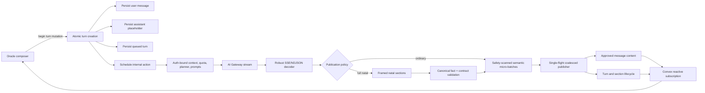

# Oracle Streaming V2 — Production Implementation Plan

Status: Local A-E implementation is complete; the full Definition of Done is not met until authenticated browser acceptance, production evaluation, and staged rollout execution pass  
Scope: Oracle chat generation, guarded publication, natal response validation, persistence, recovery, UI, observability, tests, and rollout  
Primary incident evidence: local Oracle session `ks7ajdbv7np9a18zbprbr2wadn8b0wmy`

### Implementation status (2026-07-22)

- Phase A: shared types, tolerant SSE/NDJSON protocol decoder, deadline owner, deterministic section plan/parser, canonical natal claim validators, and pure tests are implemented.
- Phase B: durable turn/section schema, atomic begin/create/migrate/stop/retry/resume APIs, one-winner claim, lifecycle transitions, and incremental idempotent turn quota accounting are implemented. Legacy client entry points remain intact.
- Phase C: the live gateway uses the Phase A decoder and full-lifetime deadlines; the scheduled runner is auth-independent and loads the linked stored user message; guarded batches and validated natal sections publish through a single-flight writer; partials, cancellation, provider fallback, targeted section repair, one automatic missing-section resume, explicit missing-key-only Resume, and placeholder finalization are persisted.
- Phase D: new model-backed sessions and follow-ups use `createSessionWithTurn` / `beginTurn`; the chat subscribes once through `getSessionConversation`; persisted stages, validated sections, Stop, linked Retry, same-turn Resume, reload/second-tab safety, and smart scrolling are rendered from server state. Zustand no longer owns generation state, while deterministic binaural and Birth Chart Report onboarding paths remain separate. Browser acceptance is not claimed because it has not been executed in a permitted authenticated environment.
- Phase E: scheduled route resolution uses the user ID bound to the durable turn; turns persist bounded stage timelines, fail-closed rollout cohorts, distinct provider-start/connected/first-token timestamps, distinct approval/persistence timing, client-visible timing, frame counters, and publication metrics; `/admin/oracle/debug` shows per-turn milestones plus fleet thresholds; a five-minute bounded maintenance job terminalizes stale turns without invoking a model; and admin settings expose deterministic live/shadow/buffered rollout controls. Production evaluation and the staged 1% → 10% → 50% → 100% rollout have not been executed from this workspace.
- Deterministic no-provider exits use a narrow `planning -> complete` bypass mutation because no provider lifecycle stage is truthful for kill-switch, crisis, quota, or hardcoded report-onboarding copy. The mutation is internal, accepts only the linked placeholder, records a safe code, performs no provider accounting, and is covered by runner tests.

## 1. Outcome

Build a server-authoritative Oracle turn system that:

- persists an assistant placeholder immediately;
- continues generation if the browser navigates away or reloads;
- progressively publishes ordinary responses in safety-scanned batches;
- progressively publishes full natal readings as canonical, safety-scanned semantic sections;
- never depends on client-local `isStreaming` state for correctness;
- handles cancellation, retries, partial streams, provider fallback, and reconnects explicitly;
- measures provider first token separately from first approved, persisted, and user-visible content;
- preserves every existing hardcoded safety, authorization, quota, journal-consent, and birth-data gate.

This is not a cosmetic loader change. It replaces the current coupling between the provider stream, Convex message mutations, final response validation, and a local React boolean with a durable turn lifecycle.

## 2. Confirmed Current Failure

The analyzed full-chart session had:

- provider TTFT: 11.72 seconds;
- total generation time: 78.15 seconds;
- user-visible incremental output: none.

The provider did stream. `convex/oracle/llm.ts` intentionally sets `publishDuringGeneration` to false for every non-temporal request requiring `natal_chart`. The action holds the entire candidate in memory, validates and possibly repairs it, then inserts the finished message. Runtime configuration can therefore say streaming is enabled while publication is still completely buffered.

Additional confirmed weaknesses:

- the provider read loop awaits Convex writes as often as every 50 ms;
- the SSE parser requires the exact prefix `data: `, silently drops malformed/provider-specific frames, and does not flush the final buffered event at EOF;
- the request abort timeout is cleared after headers, leaving only a fixed per-read idle timeout;
- a post-content transport error is returned as a partial result but is finalized like a normal response;
- lifecycle state is held in Zustand instead of persisted on the server;
- action errors are console-only;
- refresh, reconnect, cancellation, and incomplete-response recovery are not modeled;
- auto-scroll listens to message count rather than growing content;
- growing Markdown is repeatedly reparsed as one large document;
- automatic, follow-up, and retry invocation paths duplicate orchestration logic.

## 3. Non-Negotiable Invariants

The implementing agent must preserve these invariants throughout the migration.

### 3.1 Security and safety

- Crisis/input safety remains hardcoded and server-enforced before model invocation.
- Output safety remains hardcoded and server-enforced. Admin configuration cannot weaken or bypass it.
- No candidate segment becomes visible before it passes the applicable server safety check.
- Blocked raw output is never returned to a normal client. Existing admin-only quarantine evidence may be retained in the turn trace.
- Model reasoning/thinking tokens are never shown, persisted in chat messages, or logged.
- Provider keys, prompts, journal text, birth data, and raw private context are never added to normal logs or gateway event rows.

### 3.2 Data gating

- Birth context is injected only when the selected pipeline declares it.
- Journal context is injected only when the pipeline declares it and server-side consent is valid.
- Synastry continues to use names/roles rather than “Chart A” and “Chart B” in visible text.
- Canonical stored chart data remains authoritative. The generated report interpretation layer is supplemental and fingerprint-gated.

### 3.3 Turn correctness

- A client retry, double click, page reload, or second tab cannot create two generations for one turn.
- There is at most one active LLM turn per user unless a future explicit concurrency policy changes this.
- Every non-terminal turn has an assistant placeholder and a safe visible status.
- Every turn reaches one terminal state: `complete`, `incomplete`, `failed`, or `cancelled`.
- Quota/cost accounting is idempotent per turn and includes all actual provider work, including repairs and automatic section resumes.
- Provider fallback may happen silently only before approved content has been published.
- Once content is visible, the server must not silently switch to a different model and continue prose as if nothing happened.

### 3.4 UX honesty

- Never show fake percentages or fake token animation.
- Stage labels must reflect persisted server state.
- “Streaming enabled” must mean progressive user-visible publication, not merely an internal SSE transport.
- Leaving the page does not cancel generation. Only an explicit Stop action requests cancellation.

## 4. Target Architecture



The browser starts a turn with one mutation. A scheduled internal action owns the rest. The client subscribes to messages, turn status, and section state; it does not keep the generation alive.

## 5. Persisted Data Model

Add two tables to `convex/schema.ts`. New fields should initially be optional where compatibility with existing documents requires it. Never hand-edit `convex/_generated/`.

### 5.1 `oracle_turns`

Recommended fields:

```ts
{
  userId: Id<"users">;
  sessionId: Id<"oracle_sessions">;
  userMessageId: Id<"oracle_messages">;
  assistantMessageId: Id<"oracle_messages">;
  clientRequestId: string;
  retryOfTurnId?: Id<"oracle_turns">;

  status:
    | "queued"
    | "planning"
    | "connecting"
    | "generating"
    | "validating"
    | "repairing"
    | "retrying"
    | "cancel_requested"
    | "complete"
    | "incomplete"
    | "failed"
    | "cancelled";
  active: boolean;
  publicationMode: "guarded_batches" | "validated_sections" | "buffered";
  protocolVersion: "oracle-stream-v2";

  currentSectionKey?: string;
  requiredSectionKeys?: string[];
  publishedSectionKeys?: string[];
  lastSequence: number;
  publishedChars: number;
  partial: boolean;

  providerId?: string;
  model?: string;
  tier?: string;
  providerAttemptCount: number;
  repairCount: number;
  resumeCount: number;
  promptTokens?: number;
  completionTokens?: number;
  costUsdMicro?: number;
  quotaChargedAt?: number;

  safeErrorCode?: string;
  safeErrorMessage?: string;
  stopRequestedAt?: number;

  createdAt: number;
  queuedAt: number;
  actionStartedAt?: number;
  providerStartedAt?: number;
  providerFirstTokenAt?: number;
  firstApprovedAt?: number;
  firstPersistedAt?: number;
  firstClientVisibleAt?: number;
  lastProviderEventAt?: number;
  validationStartedAt?: number;
  completedAt?: number;
  failedAt?: number;
  cancelledAt?: number;
  updatedAt: number;
}
```

Required indexes:

- `by_session_created: [sessionId, createdAt]`
- `by_session_active: [sessionId, active]`
- `by_user_active: [userId, active]`
- `by_client_request: [userId, clientRequestId]`
- `by_user_message: [userMessageId]`
- `by_assistant_message: [assistantMessageId]`

`active` is deliberately separate from `status`. It makes single-flight checks and active-turn subscriptions indexed and cheap.

### 5.2 `oracle_turn_sections`

Use section records for validated natal publication and stable rendering:

```ts
{
  turnId: Id<"oracle_turns">;
  sessionId: Id<"oracle_sessions">;
  key: string;
  ordinal: number;
  title: string;
  status: "pending" | "receiving" | "validating" | "published" | "repairing" | "failed";
  content?: string;              // approved visible content only
  evidenceKeys?: string[];       // opaque canonical references, not private evidence text
  violationCodes?: string[];
  attemptCount: number;
  startedAt?: number;
  publishedAt?: number;
  updatedAt: number;
}
```

Required indexes:

- `by_turn_ordinal: [turnId, ordinal]`
- `by_turn_key: [turnId, key]`
- `by_session: [sessionId, ordinal]`

Do not persist rejected candidates here. Store only hashes, sizes, violation codes, and approved content. A safety-blocked candidate may continue to use the existing admin-authorized trace quarantine mechanism.

### 5.3 Message compatibility

Add optional fields to `oracle_messages`:

- `turnId?: Id<"oracle_turns">`
- `streamProtocolVersion?: string`

Historical messages without a turn continue rendering exactly as they do now. The assistant message remains the final canonical transcript. During generation, section records allow stable incremental rendering; on completion, materialize the ordered approved sections into `oracle_messages.content`.

## 6. State Machine and Atomic APIs

Create `convex/oracle/turns.ts`. Put all state transitions behind narrow mutations and reject illegal transitions.

### 6.1 Public `beginTurn`

Inputs:

- `sessionId`
- `content`
- `clientRequestId` generated with `crypto.randomUUID()`
- optional model option/reasoning effort
- optional debug override, accepted only for an authenticated admin
- timezone

In one mutation:

1. Authenticate the user and verify session ownership.
2. Normalize and validate non-empty content and maximum length.
3. Return the existing turn when `(userId, clientRequestId)` already exists.
4. Reject or return the existing active turn when `by_user_active` finds one.
5. Resolve/store permitted model preferences using existing server logic.
6. Insert the user message.
7. Insert an empty assistant message linked to the turn.
8. Insert a `queued`, `active: true` turn.
9. Update session counts/timestamps atomically.
10. Schedule `internal.oracle.llm.invokeOracleTurn` with `ctx.scheduler.runAfter(0, ...)`.
11. Return `{ turnId, userMessageId, assistantMessageId }` immediately.

The scheduled action makes generation independent of component effects and page lifetime.

### 6.2 New-session creation

Refactor `createSession` so non-binaural sessions atomically create the initial user message, assistant placeholder, and queued turn and schedule it. Return an object containing `sessionId` and optional `turnId`; update both call sites in `src/app/(app)/oracle/new/page.tsx`.

Binaural generation remains deterministic and must not create an LLM turn.

For existing sessions created before V2, add an idempotent `ensureTurnForUnansweredMessage` migration path. It may create a turn only when the authenticated session’s final user message has no linked assistant turn. Remove this compatibility path after old active sessions have aged out.

### 6.3 Claiming execution

The internal action first calls an atomic `claimQueuedTurn` mutation:

- `queued -> planning` succeeds once;
- any second worker receives `claimed: false` and exits;
- a terminal turn exits;
- `cancel_requested` becomes `cancelled` without a provider call.

This is the idempotency boundary for scheduled action retries and multi-tab races.

### 6.4 Stop, retry, and resume

- `requestStop(turnId)` authenticates ownership and sets `cancel_requested` plus `stopRequestedAt`.
- `retryTurn(turnId, clientRequestId)` creates a new assistant placeholder/turn linked through `retryOfTurnId`; it does not duplicate the user message.
- `resumeIncompleteTurn(turnId)` is allowed only for `incomplete` validated-section turns. It requests only missing section keys and appends/replaces by section key idempotently.
- Leaving or refreshing the page never calls `requestStop`.

### 6.5 Safe transition table

Allow only these meaningful transitions:

- `queued -> planning | cancel_requested`
- `planning -> connecting | failed | cancel_requested`
- `connecting -> generating | retrying | failed | cancel_requested`
- `generating -> validating | retrying | incomplete | failed | cancel_requested`
- `validating -> repairing | complete | incomplete | failed | cancel_requested`
- `repairing -> validating | complete | incomplete | failed | cancel_requested`
- `retrying -> connecting | incomplete | failed | cancel_requested`
- `cancel_requested -> cancelled`

Every terminal transition sets `active: false` and the matching terminal timestamp. Add pure unit tests for accepted and rejected transitions.

## 7. Provider Transport Refactor

Refactor `convex/aiGateway/streaming.ts`; extract pure framing/parsing code into `convex/aiGateway/streamProtocol.ts` so it can be tested without Convex or a real network.

### 7.1 Correct event framing

Implement a standards-tolerant SSE decoder that:

- supports `\n` and `\r\n`;
- accepts `data:` with zero or one leading space in its value;
- combines multi-line `data:` fields within one event;
- ignores comment/heartbeat lines beginning with `:`;
- recognizes `event`, `id`, and `retry` without treating them as content;
- emits the final buffered event at EOF;
- treats `[DONE]` as a terminal event and cancels the reader;
- distinguishes an incomplete network chunk from a malformed complete event;
- records malformed-frame counts and sanitized error categories instead of silently swallowing everything;
- bounds event and total buffer sizes to prevent unbounded memory growth.

Support provider payload variants through explicit adapters:

- OpenAI-compatible `choices[0].delta.content` strings;
- text content arrays where providers return typed parts;
- `choices[0].text` when present;
- final usage frames;
- provider error frames;
- reasoning/thinking deltas as private telemetry counts only, never visible content.

If a provider truly emits NDJSON rather than SSE, select an explicit decoder from provider type/content type. Do not guess line-by-line JSON inside the SSE parser.

### 7.2 Callback contract

Replace token callbacks that await persistence with transport events:

```ts
type GatewayStreamEvent =
  | { type: "attempt_started"; ... }
  | { type: "text_delta"; text: string; receivedAt: number }
  | { type: "reasoning_delta"; charCount: number }
  | { type: "usage"; promptTokens?: number; completionTokens?: number }
  | { type: "done" }
  | { type: "error"; code: GatewayErrorCode; partial: boolean; retryable: boolean };
```

The `text_delta` handler must perform only bounded in-memory parsing. Persistence runs through the publisher’s single-flight queue.

### 7.3 Deadlines

Use one `AbortController` for the complete fetch and body lifetime.

- `connectDeadlineMs`: capped at 30 seconds or lower than the overall deadline.
- `idleDeadlineMs`: reset on every valid provider event; default 30 seconds.
- `overallDeadlineMs`: use the feature profile `timeoutMs`; it remains active after headers.
- explicit cancellation: abort immediately when the turn reports `cancel_requested`.

Always clear timers and cancel/release the reader in `finally`.

Reasoning events count as provider activity for idle timeout, but do not count as first visible-content TTFT.

### 7.4 Error and fallback policy

Use a typed error taxonomy:

- `cancelled`
- `connect_timeout`
- `idle_timeout`
- `overall_timeout`
- `http_4xx`
- `http_429`
- `http_5xx`
- `auth`
- `malformed_stream`
- `provider_error_frame`
- `empty_response`
- `partial_stream`

Fallback rules:

- Before approved publication: retry the configured next provider using the same placeholder and reset the unpublished candidate/parser.
- After approved publication: do not silently change models for ordinary prose. Mark the turn `incomplete` and offer Retry/Continue.
- For validated natal sections: one bounded automatic resume is permitted because missing section keys are deterministic and section writes are idempotent. If it fails, mark `incomplete`.
- Propagate `partial` through the gateway result, Oracle result, trace, lifecycle, admin UI, and user UI. Never finalize a partial result as `complete`.

### 7.5 Runtime setting semantics

Keep provider SSE transport separate from user-visible publication. Wire the existing `stream_enabled` setting to publication policy:

- true: use guarded progressive publication;
- false: create the placeholder and lifecycle normally, but buffer approved output until finalization.

Update the admin label/help text and docs so “Streaming” clearly means user-visible progressive publication. The provider may still use SSE internally in both modes for robust timeout and usage handling.

## 8. Publication Engine

Create `convex/oracle/streamPublisher.ts` and pure helpers under `src/lib/oracle/streaming/`.

The publisher owns:

- candidate accumulation;
- segmentation;
- safety and response-contract checks;
- section state;
- ordered approved content;
- coalesced persistence;
- cancellation polling;
- publication timing metrics.

### 8.1 Single-flight persistence queue

Never await a Convex mutation from every provider delta. Use a bounded single-flight writer:

- mutate at most once every 200 ms;
- require either 128 new characters or a 750 ms maximum-latency flush;
- keep only the newest complete snapshot while one write is in flight;
- maintain monotonically increasing `sequence` values;
- have the mutation ignore a stale sequence;
- guarantee a final flush before terminal state;
- record write count and maximum queued characters;
- on a persistence failure, retry with bounded exponential backoff, then fail safely without losing the final in-memory candidate.

For natal section publication, normally write once per approved section, so it should be substantially cheaper than token streaming.

### 8.2 Ordinary response policy: `guarded_batches`

Do not publish raw tokens. Accumulate semantic micro-batches using this priority:

1. complete Markdown paragraph (`\n\n`);
2. completed list item or heading boundary;
3. sentence boundary after a reasonable minimum size;
4. forced boundary only when the pending buffer exceeds a hard maximum.

Before accepting a batch:

1. combine approved text plus the candidate batch;
2. run `scanResponse` with the consented journal context when applicable;
3. run the response validator checks that can be evaluated incrementally;
4. publish only when safe;
5. retain an overlap window so a prohibited phrase split across two batches is still scanned as one cumulative response.

Run the complete output scanner and response contract again before `complete`. If a final-only rule fails, transition to repair or the hardcoded safe fallback according to existing policy.

Expected behavior: tokens remain private for hundreds of milliseconds to a few seconds, then meaningful prose appears progressively. This is safer and visually steadier than character streaming.

### 8.3 Natal response policy: `validated_sections`

Use this mode when the deterministic request plan requires full natal coverage. Narrow natal questions may use either one validated natal section or guarded batches plus natal fact validation; do not blanket-buffer every non-temporal natal response.

Build a deterministic `OracleSectionPlan` from the request plan and canonical evidence. A full chart plan should normally include:

1. chart overview/ruler/concentrations;
2. Ascendant;
3. Sun;
4. Moon;
5. Mercury;
6. Venus;
7. Mars;
8. Jupiter;
9. Saturn;
10. Uranus;
11. Neptune;
12. Pluto;
13. nodal axis (North and South Nodes together);
14. Chiron;
15. Part of Fortune when available;
16. house signatures/themes;
17. stored aspects and pattern synthesis;
18. integrated synthesis/practical takeaways.

Only include entities/evidence actually available in canonical storage. The plan—not the model—defines section keys, order, required entities, and allowed canonical evidence keys.

### 8.4 Framed model protocol

Add a high-priority server prompt block requesting a stream-friendly framed format. Use collision-resistant, versioned markers such as:

```text
<<<ORACLE_SECTION_V2 {"key":"sun","evidenceKeys":["placement:sun","chart_ruler:sun"]}>>>
## Your Sun
...
<<<END_ORACLE_SECTION_V2>>>
```

Requirements:

- markers are never included in visible Markdown;
- only complete framed sections enter validation;
- section keys not in the server plan are rejected;
- duplicate keys are idempotently ignored or treated as a replacement attempt before publication;
- enforce maximum header and section sizes;
- parse markers across arbitrary token boundaries;
- treat malformed framing as a protocol violation, not visible content.

Multi-provider compatibility fallback: if the model returns plain Markdown or malformed framing, buffer it, run the legacy full-response validator and safety scanner, repair if needed, and publish the valid final answer. Record `section_protocol_fallback`; do not expose control markers. This fallback may be all-at-once but must still show honest lifecycle stages.

### 8.5 Section validation

Before a natal section is published:

1. verify its key exists in the deterministic section plan;
2. verify required entity names/aliases are present;
3. verify declared evidence keys are a subset of the section’s allowed keys;
4. run canonical fact validation;
5. run unsupported-aspect validation;
6. run certainty/calibration rules;
7. run cumulative output safety scanning;
8. store approved content and publish it in ordinal order.

Extend `src/lib/oracle/responseValidator.ts` with pure claim validators for:

- entity sign;
- entity house;
- direct/retrograde state when asserted;
- dignity when asserted;
- degree when asserted, with documented rounding tolerance;
- house-sign signatures;
- supported aspect body pair/type;
- required chart ruler, cluster, and nodal-axis facts when a section claims them.

The validator should reject contradictions, not attempt to judge subjective interpretation. An interpretation is acceptable when its cited/declared evidence exists and its factual claims do not contradict canonical data.

### 8.6 Section repair

When one section fails:

- mark only that section `repairing`;
- retain violation codes and hashes, not rejected prose;
- continue accepting later framed sections into their own records;
- issue a low-temperature targeted repair request containing only the section specification, canonical evidence needed for it, and violation list;
- cap repairs at one per section and a small turn-wide maximum;
- validate the repaired section through the identical path;
- if repair still fails, leave the section failed and mark the turn `incomplete`; never invent fallback astrology.

The UI renders stable section slots by ordinal. A section being repaired can show a compact “Rechecking this part…” state while later approved sections remain visible. At terminal completion, assemble all published section content into the canonical assistant message.

### 8.7 Finalization

Before `complete`:

- all required sections are published;
- the assembled response passes the full response contract;
- the assembled response passes the full hardcoded output scanner;
- hidden title/journal directives are removed;
- title generation/update is completed safely;
- final message content and metadata are persisted;
- trace, usage, cost, and quota are finalized idempotently;
- the last publisher write has completed;
- turn and assistant message transition atomically to terminal completion where possible.

Delete the blanket `requiresValidatedPublication` branch only after validated-section publication and its fallback are covered by tests.

## 9. Oracle Action Refactor

`convex/oracle/llm.ts` currently owns too many responsibilities. Refactor incrementally; do not rewrite prompt assembly and streaming simultaneously in one unreviewable change.

Recommended extraction:

- `convex/oracle/turns.ts`: public begin/stop/retry/resume plus lifecycle mutations/queries;
- `convex/oracle/turnRunner.ts`: internal turn orchestration and terminal cleanup;
- `convex/oracle/streamPublisher.ts`: guarded publication;
- `convex/aiGateway/streamProtocol.ts`: pure transport parsing;
- `src/lib/oracle/streaming/types.ts`: shared serializable lifecycle/protocol types;
- `src/lib/oracle/streaming/sectionPlan.ts`: deterministic section planning;
- `src/lib/oracle/streaming/sectionParser.ts`: pure framed-section parser;
- `src/lib/oracle/streaming/publicationState.ts`: pure state machine and reducers.

Keep `invokeOracle` temporarily as a compatibility wrapper during rollout. New UI code must use `beginTurn`; after rollout and old-session compatibility expire, remove the client action path and duplicated auto/follow-up/retry orchestration.

The internal runner must load the stored user message by ID. It must not trust a second copy of `userQuestion` supplied by the client.

All existing early exits—crisis response, kill switch, quota block, missing prerequisite, deterministic binaural behavior, and hardcoded fallback—must finalize the existing placeholder and turn rather than insert an unrelated second assistant message.

## 10. Cancellation and Liveness

The stream publisher checks cancellation at a bounded cadence, not per token:

- before planning/provider calls;
- on provider events no more often than every 500 ms;
- before each persistence flush;
- before repair/resume calls;
- before finalization.

When cancellation is observed:

1. abort the provider request;
2. cancel/release the reader;
3. flush already approved content;
4. if no content exists, keep a small “Stopped” assistant state rather than deleting the message unexpectedly;
5. transition to `cancelled`, `active: false`;
6. account for provider usage received so far;
7. never classify cancellation as provider health degradation.

Add a recovery mechanism for stale turns. A periodic internal maintenance mutation may mark a turn `incomplete` or `failed` when `active: true` and `updatedAt` is older than the maximum action duration plus a safety margin. It must never generate content or retry a model without an explicit bounded policy.

## 11. Cost, Quota, and Attempts

Current accounting focuses on the accepted first response and can miss repair/fallback work. Introduce a turn-level usage accumulator.

- Every provider attempt returns usage or a conservative estimate.
- Record attempt usage and sanitized outcomes in the trace/gateway events.
- Sum primary, fallback, repair, and automatic-resume costs into `oracle_turns.costUsdMicro`.
- Apply the quota increment exactly once using `quotaChargedAt` as the idempotency guard.
- Charge actual system spend for successful, partial, and repaired generations because quota protects platform cost.
- Crisis and deterministic bypasses retain their current zero-cost behavior.
- Retrying through an explicit new turn is a new quota event; automatic transport retry within the same turn is not a new user turn but its cost belongs to that turn.

Make quota mutations callable safely from the scheduled internal action using the stored `userId`; do not depend on browser auth context inside a scheduled action.

## 12. Client Refactor

Refactor `src/app/(app)/oracle/chat/[sessionId]/page.tsx` into focused route-local pieces.

Recommended files:

- `_components/oracle-assistant-message.tsx`
- `_components/oracle-turn-status.tsx`
- `_components/oracle-section-stream.tsx`
- `_components/oracle-turn-error.tsx`
- `_hooks/use-oracle-turn-controller.ts`
- `_hooks/use-smart-chat-scroll.ts`

Use existing shadcn-ui primitives for buttons, alerts/tooltips, and accessible status UI.

### 12.1 Server-authoritative busy state

Derive busy state from the active persisted turn returned with the session query. A tiny local `beginMutationPending` flag may prevent a same-frame double click, but it must not represent generation lifecycle.

Remove `isStreaming` from `use-oracle-store.ts` after all consumers migrate. Keep client timing/debug state only where it is genuinely client-observed.

### 12.2 Rendering

- Historical messages without turns render normally.
- A V2 assistant placeholder renders the persisted lifecycle stage.
- Validated natal sections render as memoized section components keyed by section record ID/key.
- Completed sections do not reparse when another section grows.
- Ordinary guarded batches may render from the assistant message content, but debounce expensive Markdown work and keep the active tail lightweight.
- Do not use the existing fake-streaming onboarding animation for real V2 turns.
- Hide copy/share/rating actions until a turn is terminal and contains approved content.

### 12.3 Stage copy

Use honest, accessible copy mapped from server status:

- queued: “Preparing your reading…”
- planning: “Gathering the relevant chart context…”
- connecting: “Connecting to Oracle…”
- generating: “Writing your reading…” or “Writing your Moon section…”
- validating: “Checking this against your chart…”
- repairing: “Rechecking a chart detail…”
- retrying: “The connection flickered—reconnecting…”
- cancel_requested: “Stopping…”
- incomplete: “The response was interrupted.” with Resume/Retry
- failed: “Oracle couldn’t complete this response.” with Try again
- cancelled: “Response stopped.”

Use `role="status"`, `aria-live="polite"`, and non-motion-only indicators. Avoid announcing every token or batch to screen readers.

### 12.4 Stop/retry/resume

- Show Stop only for an active turn.
- Disable new sends while the user has an active turn.
- Show Resume only for eligible validated-section incomplete turns.
- Show Try again for failed/incomplete ordinary turns.
- Surface a toast only as supplemental feedback; the durable inline state is authoritative.

### 12.5 Smart scrolling

Replace message-count scrolling with a bottom-anchor policy:

- detect whether the user is within roughly 120 px of the bottom;
- follow new approved content only while pinned near the bottom;
- never yank the viewport after the user scrolls upward;
- show a “Jump to latest” affordance when new content arrives off-screen;
- use `ResizeObserver` or section/content size changes rather than token-level React effects;
- respect reduced-motion preferences and use instant scrolling when appropriate.

### 12.6 Reconnect behavior

On reload or another tab:

- query the active turn and sections;
- render the correct server stage immediately;
- do not call the model again;
- continue receiving reactive message/section updates;
- show terminal error/incomplete state if the action ended while disconnected.

## 13. Queries and Subscription Shape

Extend `getSessionWithMessages` or add a focused `getSessionConversation` query returning:

- session metadata;
- messages;
- turns required to render those messages;
- section rows for active/recent validated-section turns;
- the single active turn.

Avoid N+1 client queries per message. Keep payload bounded:

- only fetch section records for V2 messages present in the current transcript;
- approved content belongs in either message content or section content, not duplicated indefinitely in multiple large trace fields;
- paginate old conversations before unbounded histories become a performance issue.

All public queries/mutations verify authenticated session ownership. Admin diagnostics use existing separate admin guards.

## 14. Observability

Extend turn traces and `/admin/oracle/debug` with a stage timeline. Record timestamps, durations, counters, and sanitized codes—not raw prompts or private context.

Required metrics:

- action queue delay;
- prompt/planning duration;
- provider connect duration;
- provider TTFT;
- first section/frame completed;
- first approved content;
- first persisted content;
- best-effort first client-visible content;
- provider-to-approved gap;
- approved-to-persisted gap;
- total duration;
- last provider event age;
- persistence write count;
- published character count;
- malformed/dropped provider frame count;
- required/published/failed section counts;
- protocol fallback, repair, resume, provider attempt counts;
- partial/cancel/error code;
- aggregate token/cost usage.

Add a best-effort authenticated `recordFirstClientVisible(turnId, timestamp)` mutation. Clamp/validate the timestamp and accept it only once. This is observability, never lifecycle authority.

Admin UI should visually separate:

1. request accepted;
2. provider started;
3. provider first token;
4. first approved section/batch;
5. first persisted content;
6. client first visible;
7. final validation/repair;
8. terminal state.

Alert/review thresholds after sufficient traffic:

- provider-first-token to first-persisted gap above 1.5 seconds for guarded ordinary responses;
- no turn update for more than the allowed liveness window;
- malformed stream rate above 0.5%;
- partial turn rate above 1%;
- natal section protocol fallback above 5%;
- repeated repair rate above an agreed quality threshold;
- persistence writes materially above the configured maximum.

## 15. Test Plan

Use existing Vitest/Node test infrastructure and deterministic Oracle scripts. Do not require a paid model for unit or integration coverage.

### 15.1 Pure transport tests

Create fixtures that split identical streams at every byte boundary:

- LF and CRLF;
- `data:` and `data: `;
- multi-line data fields;
- comments/heartbeats;
- `[DONE]` with and without final newline;
- usage-only final frames;
- reasoning-only frames before content;
- typed content arrays;
- provider error frames;
- malformed JSON event followed by valid events;
- EOF with remaining buffered data;
- excessive event/buffer size;
- idle, overall, and cancellation aborts.

Assert exact emitted text, usage, error type, malformed-frame count, and cleanup.

### 15.2 Section parser tests

- markers split across every token boundary;
- multiple sections in one delta;
- malformed/oversized headers;
- unknown and duplicate keys;
- missing end marker;
- marker-like prose inside Markdown/code fences;
- out-of-order sections;
- plain-Markdown protocol fallback;
- no marker text reaches visible content.

### 15.3 Validator tests

For the supplied canonical chart fixture, test:

- correct and incorrect sign/house claims for every entity;
- correct/incorrect retrograde and dignity claims;
- degree rounding boundaries;
- every stored aspect and several invented aspects;
- node-axis and chart-ruler claims;
- missing required entities/sections;
- calibrated versus deterministic language;
- cumulative safety/journal-leak scanning across batch boundaries.

### 15.4 Publisher tests with fake time

- one persistence write in flight;
- coalescing and final flush;
- monotonically increasing sequence;
- stale mutation rejection;
- failed write retry and terminal failure;
- cancellation before first content and after partial approved content;
- provider failure before publication permits fallback;
- provider failure after publication becomes incomplete;
- natal automatic resume requests only missing section keys;
- finalization waits for the final write and full validators.

### 15.5 Turn lifecycle tests

- begin mutation is atomic;
- duplicate `clientRequestId` returns the original turn;
- concurrent claim has one winner;
- illegal transitions fail;
- one active turn per user;
- refresh does not schedule another action;
- stop is idempotent;
- retry creates a linked new turn without duplicating user text;
- quota is charged once per turn;
- crisis, kill switch, quota denial, and hardcoded fallback finalize the existing placeholder.

### 15.6 Deterministic Oracle regressions

Extend `scripts/oracle/scenarios.ts` with:

- explicit full natal request requiring all available entities;
- full natal framed response with all valid sections;
- one invented natal aspect requiring section repair;
- malformed section protocol falling back safely;
- partial stream after several sections;
- ordinary long-form response using guarded batches;
- journal-consent positive and denied controls;
- non-natal negative control proving natal context is absent.

Use repo-required `vp` package commands. Permitted targeted examples should be documented once scripts exist. Do not run `vp dev`, `vp build`, `vp deploy`, `vp preview`, `vp lint`, or `vp check` unless the user explicitly asks, per `AGENTS.md`.

### 15.7 Authenticated browser acceptance

Use the dedicated non-admin Oracle test user for the customer path and a separate admin identity for traces. Never test customer behavior solely as admin.

Required scenarios:

1. Generic long answer progressively appears.
2. Full birth-chart answer shows immediate placeholder, honest stages, and progressively approved sections.
3. Refresh during generation resumes the same turn without duplication.
4. Open the same session in a second tab; no duplicate provider call occurs.
5. Scroll upward during generation; viewport is not yanked down and Jump to latest appears.
6. Stop before first content and after several sections.
7. Simulated provider interruption produces an inline incomplete state and working recovery.
8. A safety-blocked fixture never exposes blocked candidate text.
9. A journal-denied user never receives journal-derived context.
10. Completed output persists identically after refresh.

Correlate each run by session/turn ID with gateway events and the admin timeline.

## 16. Performance and Reliability Budgets

Treat these as release acceptance budgets, measured locally/staging first and then as production percentiles:

- assistant placeholder persisted within 500 ms of a successful begin-turn mutation;
- guarded ordinary provider-token-to-first-persisted gap: p95 under 1.5 seconds;
- generic persistence rate: no more than 5 writes/second, target 2–4;
- natal persistence: approximately one content write per approved section plus finalization;
- no unbounded buffer, timer, reader, or promise queue;
- no duplicate generation for the same turn in concurrency tests;
- 100% of non-terminal turns become terminal or are recovered by stale-turn maintenance;
- 0 known unsafe candidate characters published in scanner fixtures;
- 0 canonical contradictions published in deterministic natal fixtures;
- completed long answers remain responsive while rendering and scrolling.

For full natal answers, meaningful first content depends on completion of the first framed section. Target first approved section within 8 seconds of provider first token under normal provider behavior. The immediate persisted stage indicator covers provider reasoning time honestly.

## 17. Rollout and Backward Compatibility

Introduce a server-read rollout flag, for example:

- `oracle_streaming_v2_enabled`
- `oracle_streaming_v2_rollout_percent`

These flags may choose V1 versus V2 publication but must never alter safety rules. Bucket deterministically by user ID so behavior is stable.

Recommended rollout:

1. **Shadow parser:** run V2 framing/metrics internally without publishing through it; compare assembled output and frame health.
2. **Internal/admin test accounts:** V2 lifecycle and ordinary guarded batches.
3. **Dedicated non-admin test account:** natal validated sections plus refresh/cancel/recovery.
4. **1% production:** monitor partials, protocol fallback, repair, latency, write volume, and safety events.
5. **10% → 50% → 100%:** advance only after a full observation window at each stage.
6. Keep V1 buffered fallback available for one release window.
7. Remove V1 client action orchestration, Zustand streaming authority, and compatibility settings only after 100% stability.

Rollback must be one settings change to V1 buffered publication. Existing V2 turns remain readable because messages are canonical and V2 fields are additive. A rollback must not delete turns or sections.

## 18. Implementation Order and Review Gates

Do not combine all changes into one patch. Use this order:

### Phase A — Pure foundations

- Add shared lifecycle/protocol types.
- Add robust SSE decoder/adapters and exhaustive pure tests.
- Add section plan/parser and tests.
- Extend canonical fact validators and tests.

Gate: all pure tests pass; no production behavior changed.

### Phase B — Durable turns

- Add schema tables/indexes and optional message link.
- Add turn transition helpers and mutations.
- Add atomic begin/create/retry/stop APIs.
- Add scheduled internal action claim path.
- Add idempotent quota accumulator.

Gate: duplicate begin/claim/stop/quota tests pass; old messages still query/render.

### Phase C — Publisher and gateway

- Add single-flight publisher.
- Refactor gateway deadlines, cancellation, typed partial errors, and fallback.
- Implement guarded ordinary batches.
- Implement natal framed sections, validation, repair, fallback, and automatic missing-section resume.
- Route every early exit through placeholder/turn finalization.

Gate: fake-stream integration matrix passes; no unsafe or contradictory fixture content is published.

### Phase D — Client

- Switch new-session and follow-up send to atomic turn mutations.
- Subscribe to persisted lifecycle and sections.
- Add honest stages, Stop, Resume, Retry, and durable errors.
- Add smart scrolling and memoized section rendering.
- Remove duplicated invocation effects and then local streaming authority.

Gate: refresh, second-tab, scroll, stop, and recovery browser scenarios pass.

### Phase E — Observability and rollout

- Add trace/timeline metrics and admin UI.
- Add client-visible timing mutation.
- Add stale-turn maintenance.
- Add flags, shadow mode, dashboards/thresholds, and docs.
- Execute staged rollout.

Local implementation is complete. The final bullet is an operational deployment activity and remains intentionally unclaimed until an authenticated permitted environment passes the browser matrix, the production evaluation gate, and an observation window at each configured cohort.

Gate: production evaluation passes; rollout metrics satisfy budgets.

## 19. Files Expected to Change

Core:

- `convex/schema.ts`
- `convex/oracle/llm.ts`
- `convex/oracle/sessions.ts`
- `convex/oracle/quota.ts`
- `convex/oracle/traces.ts`
- `convex/oracle/debug.ts`
- `convex/aiGateway/streaming.ts`
- `convex/aiGateway/admin.ts`
- `src/lib/oracle/capabilities.ts`
- `src/lib/oracle/responseValidator.ts`
- `src/app/(app)/oracle/new/page.tsx`
- `src/app/(app)/oracle/chat/[sessionId]/page.tsx`
- `src/store/use-oracle-store.ts`
- admin Oracle debug/settings components

New modules should include:

- `convex/oracle/turns.ts`
- `convex/oracle/turnRunner.ts`
- `convex/oracle/streamPublisher.ts`
- `convex/aiGateway/streamProtocol.ts`
- `src/lib/oracle/streaming/types.ts`
- `src/lib/oracle/streaming/sectionPlan.ts`
- `src/lib/oracle/streaming/sectionParser.ts`
- `src/lib/oracle/streaming/publicationState.ts`
- route-local Oracle chat components/hooks listed above
- focused test files beside pure modules

Documentation:

- `docs/oracle/00-MASTER-WIRING-GUIDE.md`
- `docs/oracle/ORACLE_ARCHITECTURE.md`
- `docs/oracle/OPERATIONS_AND_DEBUG.md`
- `docs/oracle/TESTING_AND_SIMULATION.md`
- this plan, updated with implementation status and final deviations

Do not edit generated output, build output, or lockfiles unless a dependency change is explicitly intentional. The implementation adds no new production runtime package beyond upgrading `convex` from `^1.31.7` to `^1.32.0`; `convex-test` and `@edge-runtime/vm` are intentional dev-only additions required for the ownership, lifecycle, and Edge-runtime integration tests. The corresponding lockfile change is therefore in scope, including package-manager-resolved transitive churn.

## 20. Definition of Done

The work is complete only when all of the following are true:

Current release status: the local implementation and deterministic suites cover the code-level items below, but this Definition of Done remains open. The authenticated ten-scenario browser matrix, production evaluation gate, observation windows, staged rollout, and exercised rollback have not been completed. Do not describe Streaming V2 as production-ready until those release gates pass.

- The blanket natal publication buffer is gone from the V2 path.
- A full natal response visibly progresses section by section while preserving canonical accuracy.
- Ordinary long responses visibly progress in guarded semantic batches.
- Placeholder and lifecycle are persisted before provider generation.
- Generation survives reload/navigation and cannot duplicate across tabs.
- Stop, Retry, and eligible Resume work and persist correctly.
- Partial provider responses never masquerade as complete.
- Provider fallback follows pre-/post-publication rules.
- SSE framing, EOF, `[DONE]`, timeouts, cancellation, and malformed frames have deterministic tests.
- Server safety scans every publishable batch/section and the final assembled response.
- Canonical natal fact validators cover signs, houses, motion, dignity, degrees, house signatures, and aspects.
- One in-flight coalesced persistence writer replaces per-token awaited mutations.
- Turn-level cost/quota accounting is complete and idempotent.
- Client busy/error state is server-authoritative; Zustand no longer owns generation truth.
- Smart scroll does not yank users who read earlier content.
- Admin diagnostics distinguish provider TTFT from approved, persisted, and visible content.
- Existing birth-data, report, journal-consent, synastry, quota, admin authorization, and crisis behaviors pass regression tests.
- The authenticated browser matrix passes with separate normal-user and admin personas.
- Canonical Oracle docs are updated.
- Staged rollout and rollback have been exercised before 100% enablement.

## 21. Fresh-Agent Kickoff Prompt

Use the following when delegating implementation:

> Implement `docs/oracle/ORACLE_STREAMING_V2_IMPLEMENTATION_PLAN.md` completely and in phases. Start by reading `AGENTS.md`, the Oracle debugger skill, the canonical Oracle docs, and the current source. Preserve all hardcoded safety, authorization, quota, consent, and data-gating behavior. Do not merely remove the natal buffer: implement durable turns, robust provider parsing, guarded batch publication, validated natal sections, cancellation/recovery, server-authoritative UI state, observability, deterministic tests, and staged rollout as specified. Keep changes reviewable phase by phase, preserve unrelated worktree changes, never hand-edit generated files, use `vp` for package commands, and do not run prohibited dev/build/deploy/lint/check commands unless I explicitly authorize them. Report any justified deviation from the plan before expanding scope.
